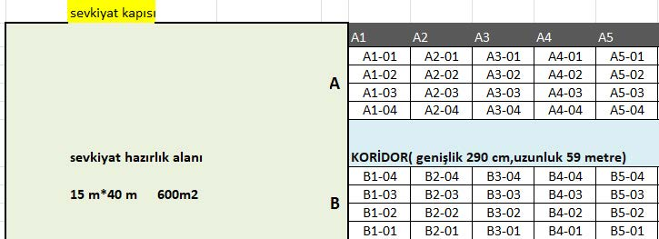

# Shelf Space Allocation

🚀 Welcome to the repository for **Shelf Space Allocation**! 

This study is a shelf space allocation study carried out at the request of the Volt Motor. Problems with allocating shelf space can take on many different forms. The reason for this is because each firm has its own unique long-term strategy, management style, product categories, competitive climate, retailer-vendor relationship, shop layout, store size, fixture structure, and so on. It is quite doubtful that we will be able to devise a mathematical model that could accurately depict each and every issue that arises while allocating shelf space in the actual world. As a result, for the sake of this research, this project primarily concentrate on an abstracted problem that may encapsulate the primary characteristics of the shelf space allocation challenges that are present in the majority of retail businesses.

In this study, the motor types and features produced by Volt Motor company were examined. It is planned to improve the level of inventory management efficiently with the machine learning models. First, prioritization was made among the motors, considering the warehouse layout of the company and the historical locations of the motor. Finally, shelves were assigned to the motors by building the recommendation system.

  

## 🌐 Explore the Project

### Datasets

#### **Motor Features I dataset: (4141 rows, 8 columns)**

|    | Column                | Description                                  |
|----|-----------------------|----------------------------------------------|
| 0  | Material ID           | Motor unique material ID                     |
| 1  | Material No           | Unique ID for the material type of the motor |
| 2  | Definition            | Description of motors                        |
| 3  | Power (kW)            | Motor power                                  |
| 4  | Pole Quantity         | Motor Pole Count                             |
| 5  | Yield Class           | Efficiency classes                           |
| 6  | Body                  | Body size of motor                           |
| 7  | Structure Shape       | Shape of motor                               |

* **Pole Quantity:** The number of permanent magnetic poles, both north and south, that are located on the rotor of a motor is referred to as the pole count. On the rotor, the number of north poles and south poles will always be equal.
* **Yield Class:** Efficiency classes developed in 2008 according to IEC (International Electrotechnical Committee) 60034-30:2008 standard have survived until today. These classes are IE1, IE2, IE3 and IE4. The most efficient class is IE4, but the least efficient is IE1.

#### **Motor Features II dataset (9391 rows, 2 columns)**
  
|    | Column                | Description                                  |
|----|-----------------------|----------------------------------------------|
| 0  | Material ID           | Motor unique material ID                     |
| 1  | Weight                | Motor weight                                 |
| 2  | Total Weight          | Total weight of the unique motors            |

#### **Volt Motor dataset: (2209489 rows, 11 columns)**

|    | Column                | Description                                  |
|----|-----------------------|----------------------------------------------|
| 0  | Serial ID             | Motor unique ID                              |
| 1  | Serial No             | Motor unique number                          |
| 2  | Material ID           | Motor unique material ID                     |
| 3  | Material code         | Motor unique material number                 |
| 4  | Production Date       | Production Date of Motor                     |
| 5  | Supply ID             | Order ID                                     |
| 6  | Exit Date             | Exit date from warehouse, shipment date      |
| 7  | Delivery Document No  | Delivery document to the customer            |
| 8  | Delivery Date         | Delivery date to the customer                |
| 9  | Stock                 | Amount of availability                       |

#### **Historical Shelf Placement dataset: (2320709 rows, 5 columns)**

|    | Column                | Description                                  |
|----|-----------------------|----------------------------------------------|
| 0  | Serial ID             | Motor unique ID                              |
| 1  | Serial No             | Motor unique number                          |
| 2  | Material ID           | Motor unique material ID                     |
| 3  | Material code         | Motor unique material number                 |
| 4  | Shelf Name            | Shelf names where the motors are placed      |

#### **Warehouse Plan & Shelf dataset:**

The warehouse plan obtained from the Volt Motor is in excel format as seen in figure 2. The yellow part shows the warehouse exit. The left part of the warehouse is the preparation area for the shipment. The right part shows the blocks (A1, A2, B1, C1… etc.) and shows shelves (A1-01, A1-02…, B1-01... etc.). Also, much other information is given in the excel file such as the dimensions of corridors, shelves, and preparation areas (Appendix A).

  

### 📬 Contact:  
Connect with us on mail for the latest updates.  

### 🌟 Acknowledgments:  
A big thank you to all contributors who have helped shape this project! 
